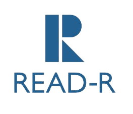

<br />
<div align="center">
  <a href="https://github.com/Monaschinas/readr-landing-page">
    
  </a>
  <h3 align="center">Readr</h3>
  <p align="center">
    Readr is a comprehensive platform that caters to both manga and light novel enthusiasts. With a focus on providing an immersive experience for readers, Readr also prioritizes the author's journey by offering a range of features that enhance the publishing experience.
    <br />
    <a href="https://github.com/Monaschinas/readr-landing-page"><strong>Explore the docs »</strong></a>
    <br />
    <br />
    <a href="https://readr-landing.netlify.app/">View Demo</a>
    ·
    <a href="https://github.com/Monaschinas/readr-landing-page/issues">Report Bug</a>
    ·
    <a href="https://github.com/Monaschinas/readr-landing-page/issues">Request Feature</a>
  </p>
</div>

<!-- ABOUT THE PROJECT -->
## About The Project

### Built With

* [![Tailwind][tailwind-shield]][tailwind-url]

<!-- GETTING STARTED -->
## Getting Started

To get a local copy up and running follow these simple example steps.

### Installation

1. Clone the repo
   ```sh
   git clone https://github.com/Monaschinas/readr-landing-page.git
   ```
2. Install NPM packages
   ```sh
   npm install
   ```
3. Run the following command to reflect the changes from tailwind using tailwind cli
   ```sh
   npm run watch
   ```

<!-- CONTRIBUTING -->
## Contributing

Contributions are what make the open source community such an amazing place to learn, inspire, and create. Any contributions you make are **greatly appreciated**.

If you have a suggestion that would make this better, please fork the repo and create a pull request. You can also simply open an issue with the tag "enhancement".
Don't forget to give the project a star! Thanks again!

1. Fork the Project
2. Create your Feature Branch (`git checkout -b feature/AmazingFeature`)
3. Commit your Changes (`git commit -m 'feat: Add some AmazingFeature'`)
4. Push to the Branch (`git push origin feature/AmazingFeature`)
5. Open a Pull Request

<!-- LICENSE -->
## License

Distributed under the MIT License. See `LICENSE.txt` for more information.

<!-- CONTACT -->
## Contact

Readr - [@readr](https://twitter.com/readr) - devcontact@readr.com

Monaschinas: [Organization's GitHub](https://github.com/Monaschinas)

<!-- Badges and URLs -->
[tailwind-url]: https://tailwindcss.com/
[tailwind-shield]: https://img.shields.io/badge/Tailwind_CSS-38B2AC?style=for-the-badge&logo=tailwind-css&logoColor=white
